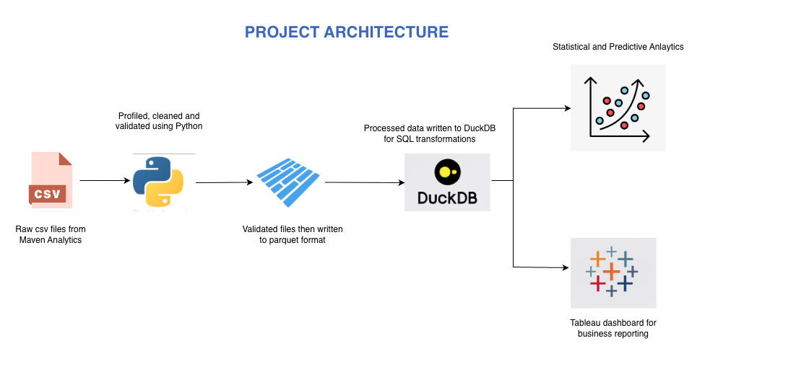
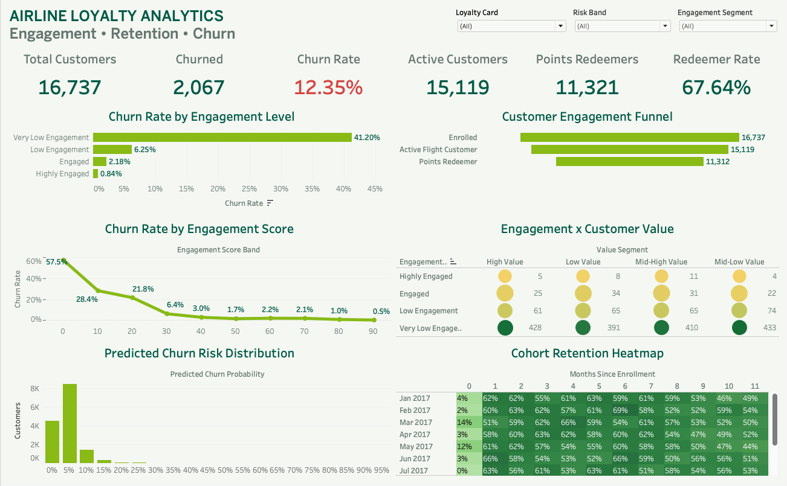

# Airline Loyalty Analytics

An end-to-end customer analytics solution for a simulated airline loyalty program, designed to analyze customer engagement, cohort retention, loyalty behaviour, and churn. The project uses Python, Pandas, DuckDB, SQL, statistical analysis, logistic regression, Parquet, and Tableau, applying data quality validation and customer-level analytical modeling before delivering business insights through an interactive dashboard.

---

## Table of Contents

- [Executive Summary](#-executive-summary)
- [Business Problem](#-business-problem)
- [Project Architecture](#-project-architecture)
- [Methodology](#-methodology)
- [Data Model](#-data-model)
- [Skills Demonstrated](#-skills-demonstrated)
- [Results & Business Recommendations](#-results--business-recommendations)
- [Recommendations](#recommendations)
- [Next Steps / Challenges / Limitations](#-next-steps--challenges--limitations)
- [Project Architecture](#-project-architecture)
- [Technology Stack](#-technology-stack)

---

## 📌 Executive Summary

This project demonstrates an end-to-end customer analytics workflow for an airline loyalty program, combining data quality validation, customer lifecycle analysis, cohort retention, segmentation, statistical testing, and churn prediction.

The raw Maven Analytics dataset is processed using Python and transformed into Parquet-based analytical data. DuckDB is then used to create a structured analytical model containing customer, date, lifecycle, cohort, retention, segmentation, funnel, churn, and customer-risk tables.

The final analysis identifies a strong relationship between customer engagement and recorded churn, while CLV shows little differentiation between churned and non-churned customers. A logistic regression model is also developed using temporally valid pre-churn behavioural features, and the resulting customer risk scores are incorporated into the final Tableau dashboard.

---

## 💼 Business Problem

Airline loyalty programs need to understand how customer engagement changes over time and which behaviours are associated with customer churn.

The objective of this project was to build an analytical solution that can answer questions such as:

- How many customers are actively engaged with the loyalty program?
- How does churn vary across engagement segments?
- How does customer value relate to churn?
- How do different enrollment cohorts retain active customers over time?
- What proportion of customers progress from enrollment to flight activity and points redemption?
- Which behavioural metrics are associated with recorded churn?
- Can recent customer activity be used to predict future churn risk?

The solution demonstrates how a customer analytics workflow can combine **data quality, SQL modeling, statistical analysis, predictive modeling, and business intelligence** to support customer retention decisions.

---

## 🏗 Project Architecture

The analytical workflow is organised as a reproducible Python, Parquet, DuckDB, SQL, and Tableau dashboard.

Raw CSV files are first profiled and validated using Python. The activity data is then cleaned, duplicate copies are removed, lifecycle flags are created, and records are aggregated to the customer-month grain before being written to Parquet.

The processed data is loaded into DuckDB, where SQL transformations create the customer, date, fact, lifecycle, cohort, retention, churn, segmentation, funnel, and customer-risk analytical tables.

The final analytical outputs are consumed by Python statistical analysis and Tableau, providing a consistent analytical foundation across customer behaviour analysis, predictive churn modeling, and business reporting.

---

## 🔧 Methodology

### 1. Data Profiling & Quality Validation

The Maven Analytics Airline Loyalty Program dataset contains customer loyalty history, monthly flight activity, and calendar data.

The raw data was profiled using Python to assess structure, missing values, duplicates, data types, categorical distributions, customer coverage, and temporal consistency before downstream analysis.

The activity dataset contains **392,936 raw rows**, while the loyalty history contains **16,737 customers**. Exact duplicate activity rows were identified and duplicate copies were removed before customer-month aggregation.

### 2. Data Cleaning & Customer-Month Aggregation

Customer flight activity was transformed to an analytical grain of **one row per customer per calendar month**.

Multiple source records for the same customer-month were aggregated using appropriate SUM logic for flight, distance, points accumulation, and redemption metrics. Zero-activity records were retained because an observed inactive month provides different information from an absent record.

Lifecycle checks identified pre-enrollment and post-cancellation activity. These records were retained and flagged rather than silently removed so that the underlying source behaviour remained visible for analysis.

### 3. Analytical Data Model

The cleaned Parquet data is loaded into DuckDB and transformed into analytical tables for customer lifecycle, monthly status, cohort retention, churn, segmentation, customer risk, and engagement funnel analysis.

The model separates customer-level attributes from monthly behavioural activity while providing reusable analytical structures for downstream statistical analysis and Tableau reporting.

### 4. Statistical & Predictive Analysis

Customer engagement was evaluated against recorded churn using Mann–Whitney U tests, Cliff's delta, chi-square tests, Cramér's V, and point-biserial correlation.

The analysis found substantial differences in behavioural activity between churned and non-churned customers. A logistic regression model was then developed using the **three months immediately preceding the prediction point**, excluding pre-enrollment and post-cancellation activity to reduce temporal leakage.

The final model achieved a **ROC-AUC of 0.639** and **PR-AUC of 0.221** on the test set. Customer-level churn probabilities were generated for **14,996 customers** who met the three-month feature requirement.

### 5. Tableau Dashboard

The final solution provides a single Tableau dashboard combining customer engagement, churn, retention, value, funnel, and predictive-risk views.

The dashboard includes KPI cards, churn by engagement level, a customer engagement funnel, churn by engagement score, engagement versus customer value, predicted churn-risk distribution, and a cohort retention heatmap.

---

## 📊 Data Model

The project follows a structured analytical architecture separating source data, cleaned customer-month activity, dimensional attributes, and business-ready analytical outputs.

**Dimensions:** `dim_customer`, `dim_date`

**Fact:** `fact_customer_month`

**Customer Analysis:** `customer_lifecycle`, `customer_monthly_status`, `customer_churn`, `customer_segments`

**Cohort & Retention:** `cohort_monthly_metrics`, `retention_metrics`

**Engagement & Risk:** `engagement_funnel`, `customer_risk`

The analytical model uses **customer_id** as the analytical customer key and maintains a clear separation between customer-level attributes and monthly behavioural activity. This allows the same DuckDB layer to support lifecycle analysis, cohort analysis, statistical testing, predictive modeling, and Tableau reporting.

---

## 🛠 Skills Demonstrated

**Data Analytics:** data profiling, data cleaning, exploratory analysis, customer lifecycle analysis, cohort analysis, retention analysis, churn analysis, customer segmentation

**Data Quality:** duplicate detection, grain validation, referential integrity checks, temporal anomaly detection, metric validation, documented data quality decisions

**Programming & Analytics:** Python, Pandas, NumPy, SciPy, scikit-learn

**SQL & Data Modeling:** DuckDB, analytical SQL, dimensional modeling, fact tables, customer-month modeling, cohort analysis, reusable analytical tables

**Statistical Analysis:** Mann–Whitney U, Cliff's delta, chi-square test, Cramér's V, point-biserial correlation, correlation analysis

**Predictive Analytics:** logistic regression, temporal feature engineering, ROC-AUC, PR-AUC, precision, recall, F1-score, threshold analysis, customer churn-risk scoring

**Business Intelligence:** Tableau, KPI development, engagement funnel, cohort retention heatmap, churn analysis, customer segmentation, risk visualization

---

## 📈 Results & Business Recommendations

The completed solution contains **16,737 customers** with complete referential coverage between the customer loyalty history and flight activity datasets.

The analytical model identifies **15,119 customers with flight activity** and **2,067 customers with recorded cancellations**, resulting in an overall recorded churn rate of approximately **12.35%**.

Customer engagement shows a strong relationship with recorded churn. The **Very Low Engagement** segment has a churn rate of **41.20%**, compared with **0.84%** for the **Highly Engaged** segment. Engagement also shows a large statistical association with churn, with Cramér's V of approximately **0.498**.

The engagement-score analysis shows the strongest churn concentration among customers with very low engagement. Customers in the **0–10 engagement score band** have a churn rate of **57.50%**, compared with **0.47%** among customers in the **91–100 band**.

The customer value segmentation produces much smaller differences, with churn rates ranging from approximately **11.90% to 12.71%** across value segments. This indicates that engagement is substantially more useful than CLV-based segmentation for differentiating observed churn in this dataset.

The churn prediction model uses three months of pre-prediction behaviour and achieves a **0.639 ROC-AUC** and **0.221 PR-AUC**. At a 0.10 classification threshold, the model achieves **18.1% precision, 36.3% recall, and an F1-score of 0.242**.

---

## Recommendations

### Customer Engagement

Prioritise retention strategies around customers showing very low engagement, as engagement is strongly associated with recorded churn. Customers with declining or consistently low flight activity should be considered for targeted re-engagement initiatives.

### Loyalty Behaviour

Use flight activity and points redemption behaviour to identify differences in customer engagement. The engagement funnel shows **15,119 active flight customers** and **11,312 customers who both flew and redeemed points**, indicating a substantial opportunity to understand what separates active customers from deeper loyalty-program participants.

### Customer Value

Avoid relying on CLV alone as a churn segmentation variable. The observed churn rates across value segments are relatively flat, while engagement provides substantially stronger differentiation.

### Churn Risk

Use the predictive churn scores as a prioritisation mechanism rather than as a definitive churn classification. Customers with elevated predicted risk can be reviewed alongside their engagement behaviour and customer profile before retention actions are taken.

### Retention

Use cohort retention analysis to compare behavioural retention across enrollment cohorts and identify whether newer or older cohorts demonstrate different engagement patterns over time.

---

## 🚧 Next Steps / Challenges / Limitations

The project uses a simulated airline loyalty dataset with a defined observation window from **2017 to 2018**, so the findings should be interpreted as analytical patterns within the dataset rather than real airline customer behaviour.

Recorded churn is based on a non-null cancellation date and should not be interpreted as inactivity-based churn. Similarly, cohort retention measures observed flight activity rather than contractual membership retention.

The churn model is intentionally designed around three complete months of pre-prediction activity to reduce temporal leakage. This means **1,741 of the 16,737 customers do not receive a modelled churn probability** because they do not meet the feature-window requirements.

Future extensions could include time-based model validation, alternative classification models, probability calibration, additional behavioural features, survival analysis, customer-level intervention testing, and automated model monitoring.

The current Tableau dashboard provides a consolidated view of engagement, retention, churn, customer value, and predicted risk. A production implementation could further integrate automated reporting, scheduled model refreshes, and governed data pipelines.

---

## 🧰 Technology Stack

**Languages:** Python, SQL

**Data Processing:** Pandas, NumPy, PyArrow, Parquet

**Database:** DuckDB

**Statistical Analysis:** SciPy, Mann–Whitney U, Cliff's delta, Chi-square, Cramér's V, Point-biserial correlation

**Predictive Analytics:** scikit-learn, Logistic Regression, ROC-AUC, PR-AUC, Precision, Recall, F1-score

**Analytics & Visualization:** Matplotlib, Tableau

**Data Modeling:** Customer-level dimensions, customer-month fact table, lifecycle analysis, cohort analysis, retention metrics, customer segmentation, churn-risk modeling

**Architecture:** Python Validation → Parquet → DuckDB → SQL Analytical Model → Statistical & Predictive Analysis → Tableau
